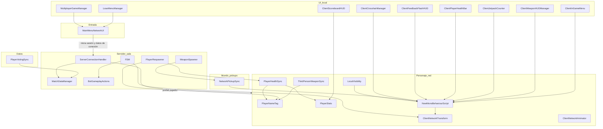
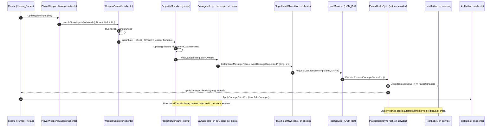
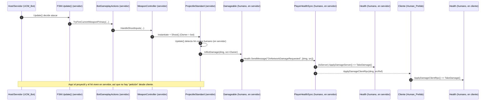
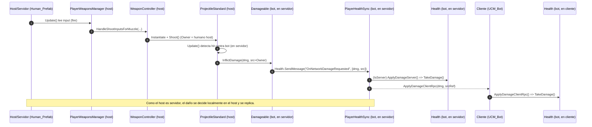
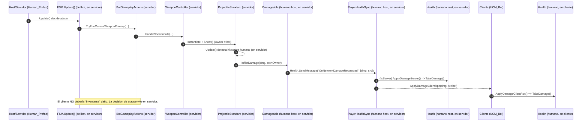

# FPS Online

Se convierte el proyecto Unity original UPV-FPS de la versión 6000.3.9.f1 a *6000.3.12f1*, perdiendo registros del GitLab anterior. ¡Ojo, es importante *trabajar todos en esta versión*, para tener la versión funcional con las herramientas de pruebas de modo multijugador de Unity! Recuerda descargarlo usando Git LFS.

Se ha borrado la plantilla de documentación que venía originalmente con el repositorio, y a continuación se expone una información mínima. De todas formas son los ficheros FSM.cs y BotGameplayActions.cs sobre los que hay que trabajar más para cambiarlos por completo y tener allí tanto la máquina de estados jerárquica (capaz de cargar datos de una FSM particular de un fichero de texto y ejecutarla después) como el gestor de acciones con el que CONCRETAMOS lo que se hace o consulta en cada estado o transición de la FSM.

Para poder hacer pruebas de multijugador desde Unity, que es mucho más cómodo que andar creando ejecutables todo el rato, hay que ir a Window > Multiplayer > Multiplayer Play Mode y marcar que queréis al menos un virtual player (Player 2). Se os abrirá una segunda ventana de juego y al dar a Play podréis jugar simultáneamente con las dos ventanas.

## Primera parte: FPS Microgame

Asumimos que la UPV ha empezado trabajando sobre la plantilla de aprendizaje [FPS Microgame](https://learn.unity.com/project/fps-template), de la propia Unity Technologies. Al menos en su última versión esta plantilla es un pequeño juego de disparos en primera persona para un jugador con escenas de victoria/derrota, objetivos, enemigos móviles (hover bots) y torretas, armas variadas y hasta un tutorial embebido (porque está pensado como material para aprender a desarrollar en Unity).

Más información sobre esta plantilla en nuestro repositorio [fps](https://github.com/narratech/fps).

## Segunda parte: FPS UPV

La versión multijugador ha sido desarrollada por el equipo de la UPV y se llama FPS-UPV, cuyo ZIP puede descargarse del [sitio web de la competición Bot Prize](https://botprize2026.ai2.upv.es/) del congreso [Conference on Games 2026](https://cog2026.fdi.ucm.es/).
Asumimos que su desarrollo parte del FPS Microgame original, aunque se han incluido algunos add-ons que están disponibles para esta plantilla en la Asset Store (como el lanzallamas) y por supuesto se ha añadido todo el soporte multijugador usando Netcode for Game Objects.

### Descripción

Esta extensión de FPS Microgame convierte una experiencia pensada para un sólo jugador en una sola máquina en un juego multijugador donde varios jugadores humanos (o bots, controlados por la máquina) pueden estar en una misma escena, verse entre sí, luchar, reaparecer si mueren y en definitiva usar las mismas reglas de armas y vida que ya tenía el juego pero para pelearse entre sí.

La carpeta de scripts MiMultiplayer es el “cableado” entre el juego original y esa nueva escena multijugador: cómo se entra, quién puede hacer qué decisión (para que no haya dos versiones contradictorias de los resultados de un combate), cómo se elige el aspecto de cada jugador, cómo se mueve y se anima lo que ven los demás, despliegue de menús y finales de partida que respetan quién manda en el juego... y un bloque opcional de recogida de datos (votaciones / exportación) pensado para análisis o experimentos con jueces humanos (aunque ahora mismo no está operativo).

La idea es que haya una máquina que haga de servidor (bueno, en realidad un cliente/servidor que hace ambas cosas a la vez): acepta entradas, crea las “copias” oficiales de jugadores y objetos compartidos, y es la autoridad (es decir, quien tiene la última palabra) en cosas como daño, muerte, contadores y aparición de objetos en el mundo.
Cada participante tiene su propia pantalla y controles locales: envía intenciones (moverse, disparar, coger algo) hacia el servidor; el servidor valida o unifica y el resultado se notifica a los clientes para que se refleje en todas sus pantallas.
Los bots son diferentes porque no usan el teclado de nadie: su “cerebro” vive en el servidor, no en el cliente, y el resto de clientes sólo ven el resultado (posición, animación) que envía el servidor, para asegurarnos de que todos vean lo mismo.
Fin de partida y cambio de escena: técnicamente quien lleva el servidor puede arrastrar a todo el grupo a otra pantalla (victoria, derrota, repetir); aunque un cliente sin ese rol no puede reiniciar la partida para los demás, sólo salirse o seguir escuchando lo que diga el servidor.
En resumen: esta parte añadida de multijugador reparte responsabilidades entre “quien mantiene la verdad del juego” (la autoridad) y “quien sólo interpreta y muestra”, adaptando el HUD, menús y personajes para que encajen con esa repartición.

### Escenas

IntroMenu es la escena que contiene el menú del juego. Como novedad encontramos estos objetos:
* StartButtonsManager, donde se ha incluido el script MainMenuNetworkUI que permite poner en marcha el juego en red, tanto de cliente como de servidor
* LocalRespawnService, para respawnear objetos del juego (es en sí mismo un objeto no destruible al cargar escenas)
* NetworkManager, para llevar todo el tema de la sesión de juego en red... se usa el componente Unity Transport (es en sí mismo un objeto no destruible al cargar escenas)
* [Debug Updater], pequeña herramienta para ayudar a la depuración... (es en sí mismo un objeto no destruible al cargar escenas)

MainScene es la escena principal del juego, una sala de ejemplo donde poder probarlo todo. Como novedad encontramos estos objetos:
* NetworkManager (realmente no hace falta porque vendrá del propio menú)
* RespawnPoints, puntos de respawn
* WeaponSpawner, respawn de armas
* Player_Network, quizá tampoco se usa porque aparecen los jugadores sobrela marcha
* AnalysisDataManager, para análisis de datos que no estamos usando

### Clases y sus relaciones

Los sistemas principales (bloques en que estructura la aplicación) que encontramos en el diseño software de esta parte multijugador son estos:

| Bloque | Rol |
|--------|-----|
| Entrada y sesión | Pantalla inicial: apodo, dirección del servidor, personaje; arranque como servidor o como cliente (a veces se les llama "la sala y el invitado"); carga del mapa acordado. |
| Admisión y registro | Al unirse alguien, se interpreta su "ficha de datos” (nombre + elección de personaje), se fija qué prefab usar y se notifica al registro de jugadores para datos/análisis. |
| Personaje en red | Prefabs humano/bot con sincronización de posición (ojo, distinta lógica para humano vs bot), vida/daño centralizado, reaparición, nombre y marcador. |
| Mundo compartido | Armas sueltas en el mapa: quién las coge, cómo desaparecen para todos y cómo el cliente local actualiza su inventario. Los vigilantes robóticos sin embargo no están en el mundo compartido... |
| Presentación local | Mirillas, barra de vida, flashes de daño, jetpack, marcador, pausa -por supuesto sin congelar el tiempo para los demás-. |
| Flujo de partida | Victoria/derrota: sólo quien lleva el servidor inicia el cambio de escena grupal; menú de derrota distingue servidor y cliente. || IA de bots (aquí falta el desarrollo más académico de un bot con máquina de estados jerárquica o como fuese) | Máquina de estados mínima (es sólo un ejemplo) + capa de “acciones” en servidor; movimiento por malla de navegación; animación en tercera persona derivada del movimiento real. |
| Datos / votación | Registro de votos por identificador de cliente; exportación a archivo (el código está presente, pero la escritura en disco ahora mismo la hemos dejado comentada porque era un rollo). |

Hay un punto delicado y es que coexisten PlayerNameTag (nombre propietario + kills/deaths que actualiza PlayerRespawner) y PlayerStats (nombre servidor + kills/deaths en muerte). El HUD ClientScoreboardHUD lee PlayerStats; el script del jugador llamado internamente NewMonoBehaviourScript (que debería llamarse al menos como el fichero, ClientPlayerMove) arma un marcador desde PlayerNameTag. ¡Conviene tener claro cuál es la fuente de verdad que se quiere mostrar, porque tener 2 no es buena idea!

En este diagrama se muestran las clases principales.

Ojo porque los HUD apuntan conceptualmente al “jugador local” vía FindObjects* / IsOwner... no siempre por referencia explícita en código.

#### Entrada y flujo global
* MainMenuNetworkUI
Responsabilidad: flujo de UI del menú (jugar, elegir rol, conectar), validar apodo, guardarlo para la partida, empaquetar nombre + índice de personaje en los datos de conexión, configurar dirección/puerto e iniciar sala o invitado (es decir, servidor o cliente); en modo sala carga la escena de juego acordada.
Problema que resuelve: un solo sitio donde el jugador humano deja constancia de quién es y qué aspecto quiere antes de entrar en la sala.
Interacción: alimenta lo que lee el admitidor de conexiones; usa el gestor de red global de la escena.

* ServerConnectionHandler
Responsabilidad: en cada nueva conexión, lee el "maletín" (la ficha), aprueba la entrada, fija qué prefabricado de personaje corresponde al índice elegido y avisa a MatchDataManager para registrar nombre e id de cliente.
Problema: que cada entrante tenga el personaje correcto sin depender del prefab, por defecto único.
Interacción: lista de prefabs “universidades”; MatchDataManager; configuración del gestor de red (aprobación de conexiones).

* MultiplayerGameManager (adaptación del gestor de fin de juego del microjuego)
Responsabilidad: al acabar la partida (p. ej. muerte del jugador en modo clásico), sólo la sala o el modo offline inicia el fundido y el cambio de escena; los invitados no cargan escena por su cuenta, esperan al anfitrión.
Problema: evitar desincronización de escenas entre máquinas.
Interacción: sistema de eventos del juego base (PlayerDeathEvent); gestor de red para cargar escena en grupo.

* LoseMenuManager
Responsabilidad: UI de derrota: volver al menú inicial (cerrar sesión y destruir el gestor de red para un estado limpio) o, sólo si eres anfitrión, “jugar otra vez” cargando otra escena para todos.
Problema: que un invitado no vea una acción que la sala no puede cumplir (reinicio global).
Interacción: gestor de red y carga de escenas locales vs grupales.

#### Personaje del jugador
El personaje del jugador tiene movimiento, vida, reaparición, identidad... y todo tiene que funcionar por red.

* NewMonoBehaviourScript (convendría renombrarlo; actúa como controlador del jugador propietario en red)
Responsabilidad: al nacer en red, apaga cámara, input y gameplay del microjuego para no “jugar en el menú”; al entrar en escenas jugables, enciende todo; arreglos de escucha de audio si falta un oyente; construye un marcador textual local leyendo todos los PlayerNameTag.
Problema: transición menú ↔ mapa con un solo prefab de jugador que existe ya en red antes del mapa.
Interacción: escenas por nombre; PlayerNameTag; componentes del microjuego (PlayerCharacterController, Health, etc.).

* ClientNetworkTransform
Responsabilidad: decide si la posición la manda quien posee el personaje (humano) o la sala (si hay máquina de estados de bot).
Problema: humanos y bots no pueden usar el mismo criterio de autoridad sin teleportes o trampas en cliente.
Interacción: componente FSM como señal de “es bot”.

* ClientNetworkAnimator
Responsabilidad: animación no gobernada solo por la sala (dueño puede influir en parámetros replicados según el diseño del componente base).
Problema: coherencia visual del personaje propio frente a la réplica en otros.
Interacción: NetworkAnimator del paquete de red.

* PlayerHealthSync
Responsabilidad: cuando el sistema de daño del juego pide daño vía mensaje, en la sala aplica el golpe de forma oficial y ordena a las demás máquinas que apliquen el mismo golpe para efectos locales; si quien dispara no es la sala, pide a la sala que lo haga.
Problema: que nadie pueda “bajarse vida arbitraria” desde su máquina sin pasar por la sala.
Interacción: Health, Damageable / SendMessage; referencias de red al origen del daño para atribución.

* PlayerRespawner
Se trata de un componente clave. Mezcla lógica de sala/servidor (spawn, revive, bots) y ritual de muerte en el cliente humano (el fundido, por ejemplo); conviene entenderlo bien antes de cambiar flujos de muerte.
Responsabilidad: en la sala, primera aparición en puntos del mapa con reglas de separación y respaldo por malla de navegación; en muerte, sube contadores en PlayerNameTag, distingue bot (todo en sala, sin fundido de muerte local) de humano (espera, oculta fundido de fin de juego si aplica, pide reaparición a la sala); la sala teletransporta, revive y avisa a todos con la misma posición/rotación.
Problema: spawns justos, atribución de bajas y reaparición sin dejar al personaje atravesando suelo.
Interacción: Health, PlayerNameTag, FSM para detectar bot, GameFlowManager para no pisar el UI de “game over” del single-player.

A continuación tenemos también estas dos clases "duplicadas": dos fuentes de kills/muertes/nombre; ojo, el HUD oficial del prefab puede NO coincidir con el marcador creado en NewMonoBehaviourScript si no se unifican criterios.

* PlayerNameTag
Responsabilidad: nombre replicable (quien posee el personaje lo sube desde preferencias); kills/muertes con escritura solo en sala; texto sobre la cabeza y billboard hacia la cámara; el dueño puede ocultar su propio cartel.
Problema: identificación social y marcador ligero.
Interacción: PlayerRespawner (y posiblemente IA por SendMessage para kills de enemigos PvE).

* PlayerStats
Responsabilidad: otra vía de nombre + kills/muertes con nombre copiado desde PlayerNameTag en la sala y actualizado en muerte vía último origen de daño.
Problema: marcador servidor-autoritativo desacoplado del tag.
Interacción: PlayerNameTag, Health; consumido por ClientScoreboardHUD.

#### Bot

* FSM
Responsabilidad: en la sala, tras esperar a mapa y actores listos, prepara navegación, desactiva control humano conflictivo, máquina de estados mínima (inactivo → deambular → muerto) con ejemplo de puntos aleatorios en malla; reacciona a curación/muerte.
Problema: plantilla académica donde la decisión (estados) está separada de las acciones.
Interacción: BotGameplayActions, Health, PlayerRespawner, ClientNetworkTransform.

* BotGameplayActions
Responsabilidad: crear/configurar agente de navegación, órdenes de ir/parar/mirar, puente opcional a armas del microjuego, animación tercera persona estimando avance lateral/adelante desde el movimiento real del cuerpo.
Problema: un solo sitio con nombres claros (“ir aquí”, “disparar”) para que la FSM no dependa de cada detalle interno del personaje.
Interacción: NavMeshAgent, PlayerWeaponsManager, PlayerCharacterController (animator).

####  Mundo y pickups
* WeaponSpawner
Responsabilidad: en la sala, temporizador para instanciar y “publicar” un pickup de arma aleatorio de una lista mientras no haya uno activo del spawner.
Problema: reaparición de loot una sola verdad en la sala.
Interacción: prefabs con objeto de red.

* NetworkPickupSync
Responsabilidad: el pickup escucha la petición del microjuego; el dueño del personaje que tocó pide a la sala coger el arma; la sala marca como cogido, manda al cliente ganador que ejecute la concesión de arma en su copia local y retira el objeto de la red.
Problema: carreras entre dos jugadores y inventario solo en el cliente correcto.
Interacción: WeaponPickup, PlayerCharacterController, LocalWorldPickupRespawn (en otro ensamblado) para reaparición local opcional.

#### Presentación 
Ya sea que haya mostrar al personaje en tercera persona / local / HUD.

* ThirdPersonWeaponSync
Responsabilidad: índice de arma visible replicado; el dueño escucha cambios de arma y actualiza la variable; todos encienden/apagan modelos “fantasma” y enganchan IK de mano.
Problema: que los demás vean qué arma llevas sin replicar todo el inventario al detalle.
Interacción: PlayerWeaponsManager, NetworkVariable.

* LocalVisibility
Responsabilidad: para tu propia copia, cuerpo y armas tercera persona en modo sombra (o visibles si se configura); brazos de primera persona solo para ti; los demás te ven completo.
Problema: cámara primera persona sin “ver dentro del cuerpo” de forma molesta.
Interacción: SkinnedMeshRenderer, capas de armas/brazos.

* ClientFollowPlayer
Responsabilidad: objeto que sigue al jugador marcado por ActorsManager (offset conservado), útil para cámara u objeto hijo en multijugador cuando el jugador aparece tarde.
Problema: referencias rotas si el manager aún no tiene jugador.
Interacción: ActorsManager.

* ClientCrosshairManager, ClientFeedbackFlashHUD, ClientPlayerHealthBar, ClientJetpackCounter
Responsabilidad: versiones “con red” del HUD del microjuego: en el spawn, solo el dueño vuelve a enlazar con su PlayerWeaponsManager / Health / Jetpack (el Start original a veces enganchaba al personaje equivocado en sala).
Problema: HUD global que antes asumía un único jugador en escena.
Interacción: mismos eventos y APIs que el HUD original.

* ClientScoreboardHUD
Responsabilidad: solo dueño; refresca texto con todos los PlayerStats.
Problema: marcador global legible.
Interacción: PlayerStats (no PlayerNameTag).

* ClientWeaponHUDManager
Responsabilidad: MonoBehaviour que busca de forma perezosa al jugador local y suscribe contadores de munición a su PlayerWeaponsManager.
Problema: mismo que arriba, sin heredar de red.
Interacción: AmmoCounter, prefabs de UI.

* ClientInGameMenu
Responsabilidad: pausa sin detener el tiempo del juego (los demás siguen); encuentra al jugador dueño y enlaza sensibilidad, sombras, invencibilidad, FPS.
Problema: timeScale = 0 rompería multijugador.
Interacción: Input System, PlayerInputHandler, Health.

#### Datos y análisis
Esta parte para permitir votar a los jueces y decir qué bot parece más humano... está todavía sin terminar.

MatchDataManager
Responsabilidad: singleton en sala: registro de jugadores (incluido anfitrión al arrancar), votos recibidos por objetivo (humano vs “robot”), agregación para exportación JSON; la escritura a disco está comentada.
Problema: trazabilidad post-partida sin mezclar lógica de combate.
Interacción: ServerConnectionHandler, PlayerVotingSync.

PlayerVotingSync
Responsabilidad: desde el dueño del personaje que vota, envía a la sala un voto contra el objetivo (jugador de red válido); la sala registra en MatchDataManager.
Problema: votos validados en sala (no confiar en el cliente para el registro final).
Interacción: MatchDataManager, NetworkObject.

### Principales prefabs

En lo que es la escena podemos tener a *Human_Prefab*, que representa al jugador humano, y *UCM_Bot* que es la IA que hay que programar si se quiere tener un bot contra el que enfrentarse.

* Human_Prefab
Ruta: Assets/FPS/Scripts/MiMultiplayer/Human_Prefab.prefab

Es el “paquete completo” del jugador: control FPS, cámara, armas, vida/daño y los componentes oficiales de Netcode que permiten hacer multijugador en Unity.

Lo más relevante que puede encontrarse en la raíz de este prefab es esto:
    * NetworkObject: identidad de red del jugador.
    * PlayerInput (Input System): componente de Unity que gestiona dispositivos/mapas de entrada.
    * NewMonoBehaviourScript (tu “ClientPlayerMove” real, el hombre es que no está bien puesto): habilita cámara/controles sólo para el propietario, crea el HUD del marcador, etc.
    * PlayerRespawner: maneja muerte/respawn en red (RPC al server y respawn al cliente).
    * ClientNetworkTransform: sincroniza transform (owner authority en tu setup). Junto a FSM son componentes clave y ahora mismo está organizado así: patrón explícito humano = autoridad del dueño, bot = autoridad de la sala. Así se ha decidido llevar los bots al servidor.
    * PlayerHealthSync: sincroniza vida/estado. Se trata de un componente crítico, un núcleo de integridad del combate (sala como árbitro del daño).
    * PlayerVotingSync (solo en Human): sistema de votación/acciones especiales.
    * PlayerNameTag: nombre/kills/deaths en red.
    * ClientNetworkAnimator: Script para hacer animación sincronizada.
    * Rigging / IK / Weapon sync: WeaponIKSync, ThirdPersonWeaponSync, RigBuilder, constraints, etc. Son scripts de sincronización (por ejemplo PlayerHealthSync, ThirdPersonWeaponSync, LocalVisibility...).
    * UI (CanvasScaler, GraphicRaycaster, TMP): el canvas world-space del nametag y elementos.
    * CharacterController: componente nativo de Unity para mover un “personaje tipo cápsula” en el mundo sin usar un Rigidbody. Gestiones colisiones, deslizamiento, movimiento 'cinemático', grounding básico... pero no hace nada más.
    * PlayerCharacterController: Script de este proyecto que hace las veces de MENTE del CharacterController, lee la entrada con PlayerInputHandler, y lo convierte en movimiento, rotación, coordina la cámara, la animación, está pendiente de la salud, muerte, apuntado, etc. 

* UCM_Bot
Ruta: Assets/FPS/Scripts/MiMultiplayer/UCM_Bot.prefab

En UCM_Bot encontramos componentes muy parecidos, aunque se ha añadido FSM como ejemplo de dónde podría ir una máquina de estados que tome las decisiones de ese bot (hay que sustituir COMPLETAMENTE todo ese código), y BotGameplayActions para hacer las veces de gestor de acciones, aunque también hace cosas como crear el componente NavMeshAgent en caso de que no lo tenga (que de hecho no lo tiene añadido ahora mismo). 

### Ejemplos de secuencias de disparo

Si asumimos que el servidor es UCM_Bot y el cliente Human_Prefab, esta sería la secuencia de disparo del cliente al servidor: 

Y esta sería la secuenica de disparo contraria, del servidor al cliente: 

Si asumimos que el servidor es Human_Prefab y el cliente UCM_Bot, esta sería la secuenica de disparo del servidor al cliente: 

Y esta sería la secuenica de disparo contraria, del cliente al servidor: 

En resumen, cuando dispara un cliente humano el proyectil impacta EN el cliente, así que PlayerHealthSync en esa copia del objetivo NO es servidor y por lo tanto debe pedir al servidor que se realice el daño con RequestDamageServerRpc.
Por otro lado cuando dispara el servidor (sea el jugador humano o el bot, que se ejecuta siempre en el servidor) el proyectil impacta en el propio servidor, de manera que PlayerHealthSync ya está en modo servidor y puede aplica el daño directo, únicamente replicando ese daño en los clientes con ApplyDamageClientRpc.
