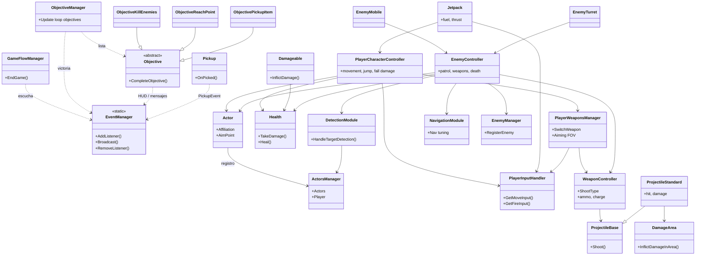

# FPS Online

Se convierte el proyecto Unity original UPV-FPS de la versión 6000.3.9.f1 a *6000.3.12f1*, perdiendo registros del GitLab anterior. ¡Ojo, es importante *trabajar todos en esta versión*, para tener la versión funcional con las herramientas de pruebas de modo multijugador de Unity! Recuerda descargarlo usando Git LFS.

Se ha borrado la plantilla de documentación que venía originalmente con el repositorio, y a continuación se expone una información mínima. De todas formas son los ficheros FSM.cs y BotGameplayActions.cs sobre los que hay que trabajar más para cambiarlos por completo y tener allí tanto la máquina de estados jerárquica (capaz de cargar datos de una FSM particular de un fichero de texto y ejecutarla después) como el gestor de acciones con el que CONCRETAMOS lo que se hace o consulta en cada estado o transición de la FSM.

Para poder hacer pruebas de multijugador desde Unity, que es mucho más cómodo que andar creando ejecutables todo el rato, hay que ir a Window > Multiplayer > Multiplayer Play Mode y marcar que queréis al menos un virtual player (Player 2). Se os abrirá una segunda ventana de juego y al dar a Play podréis jugar simultáneamente con las dos ventanas.

## FPS Microgame

Asumimos que la UPV ha empezado trabajando sobre la plantilla de aprendizaje [FPS Microgame](https://learn.unity.com/project/fps-template), de la propia Unity Technologies. Al menos en su última versión esta plantilla es un pequeño juego de disparos en primera persona para un jugador con escenas de victoria/derrota, objetivos, enemigos móviles (hover bots) y torretas, armas variadas y hasta un tutorial embebido (porque está pensado como material para aprender a desarrollar en Unity).

Se trata de una experiencia de acción en primera persona, pensada como plantilla jugable y didáctica: un nivel cerrado donde avanzas, combates y cumples metas hasta ganar o perder. El propósito es ofrecer un bucle de juego completo (moverse, disparar, recoger cosas, completar objetivos, pantalla final, etc.) que sirva de base para aprender o para construir encima un FPS propio.

Cuando juegas apareces en un escenario 3D en vista en primera persona. Tu personaje recorre el entorno, esquiva o enfrenta enemigos y progresa cumpliendo condiciones de misión (por ejemplo las misiones podrían ser eliminar enemigos, llegar a un cierto punto o interactuar con un objeto clave). Si tu salud cae a cero, la partida termina en derrota; si completas todo lo que la misión exige, ganas y pasas a una pantalla de victoria.

Las mecánicas principales son:
* Desplazamiento: caminar en el suelo, correr más rápido, agacharse (menos perfil y movimiento más lento), saltar y moverse en el aire con inercia propia del salto.
* Combate: varias armas con comportamientos distintos (disparo simple, ráfaga o disparo que se carga antes de soltar); apuntar suele acercar la “vista” y estabilizar la puntería; hay munición y recarga. Algunas armas pueden sobrecalentarse visual y sonoramente si se abusa del disparo.
Daño y supervivencia: recibes daño de enemigos, explosiones de área o caídas muy bruscas; puedes curarte con objetos del escenario.
Progresión en el mapa: objetivos que se muestran en pantalla (texto, contadores, avisos cuando queda poco por hacer); a veces un indicador de brújula hacia puntos importantes.
Jetpack (si está desbloqueado en la partida): en el aire, tras un salto, puedes impulsarte hacia arriba mientras dure el combustible; en suelo o tras un tiempo sin usarlo, el medidor se recupera.
Recogibles: salud, munición, armas nuevas, desbloqueo de jetpack, etc., suelen flotar y girar en el nivel hasta recogerlos.
Fin de partida: transición con oscurecimiento gradual y sonido; según el resultado cargas una pantalla de victoria o de derrota.
Controles (orientación práctica; el proyecto admite teclado/ratón y mando)

Movimiento: direcciones adelante/atrás/lados (teclado tipo WASD o flechas; stick izquierdo en mando).
Mirar: ratón o stick derecho.
Saltar; sprint (correr); agacharse.
Disparar y apuntar (botones típicos de ratón o gatillos del mando).
Recargar.
Cambiar de arma (rueda del ratón y/o ejes en teclado/mando según la asignación del proyecto).
Menú en partida: pausa, ajustes de sensibilidad, sombras, invencibilidad de prueba, FPS en pantalla, imagen de controles.
Jetpack: en el aire, mantener la acción de salto mientras el sistema lo permite y haya combustible (tras haber pulsado salto otra vez en el aire para “armar” el uso).

### Descripción

### Clases y sus relaciones

## FPS UPV

La versión multijugador ha sido desarrollada por el equipo de la UPV y se llama FPS-UPV, cuyo ZIP puede descargarse del [sitio web de la competición Bot Prize](https://botprize2026.ai2.upv.es/) del congreso [Conference on Games 2026](https://cog2026.fdi.ucm.es/).

### Descripción

### Clases y sus relaciones

*Human_Prefab* representa al jugador humano y *UCM_Bot* es la IA que hay que programar si se quiere tener un bot contra el que enfrentarse.

#### Human_Prefab
Ruta: Assets/FPS/Scripts/MiMultiplayer/Human_Prefab.prefab

Es el “paquete completo” del jugador: control FPS, cámara, armas, vida/daño y los componentes oficiales de Netcode que permiten hacer multijugador en Unity.

Lo más relevante que puede encontrarse en la raíz de este prefab es esto:

* NetworkObject: identidad de red del jugador.
* PlayerInput (Input System): componente de Unity que gestiona dispositivos/mapas de entrada.
* NewMonoBehaviourScript (tu “ClientPlayerMove” real, el hombre es que no está bien puesto): habilita cámara/controles sólo para el propietario, crea el HUD del marcador, etc.
* PlayerRespawner: maneja muerte/respawn en red (RPC al server y respawn al cliente).
* ClientNetworkTransform: sincroniza transform (owner authority en tu setup).
* PlayerHealthSync: sincroniza vida/estado.
* PlayerVotingSync (solo en Human): sistema de votación/acciones especiales.
* PlayerNameTag: nombre/kills/deaths en red.
* ClientNetworkAnimator: Script para hacer animación sincronizada.
* Rigging / IK / Weapon sync: WeaponIKSync, ThirdPersonWeaponSync, RigBuilder, constraints, etc. Son scripts de sincronización (por ejemplo PlayerHealthSync, ThirdPersonWeaponSync, LocalVisibility...).
* UI (CanvasScaler, GraphicRaycaster, TMP): el canvas world-space del nametag y elementos.
* CharacterController: componente nativo de Unity para mover un “personaje tipo cápsula” en el mundo sin usar un Rigidbody. Gestiones colisiones, deslizamiento, movimiento 'cinemático', grounding básico... pero no hace nada más.
* PlayerCharacterController: Script de este proyecto que hace las veces de MENTE del CharacterController, lee la entrada con PlayerInputHandler, y lo convierte en movimiento, rotación, coordina la cámara, la animación, está pendiente de la salud, muerte, apuntado, etc. 

#### UCM_Bot
Ruta: Assets/FPS/Scripts/MiMultiplayer/UCM_Bot.prefab

En UCM_Bot encontramos componentes muy parecidos, aunque se ha añadido FSM como ejemplo de dónde podría ir una máquina de estados que tome las decisiones de ese bot (hay que sustituir COMPLETAMENTE todo ese código), y BotGameplayActions para hacer las veces de gestor de acciones, aunque también hace cosas como crear el componente NavMeshAgent en caso de que no lo tenga (que de hecho no lo tiene añadido ahora mismo).

